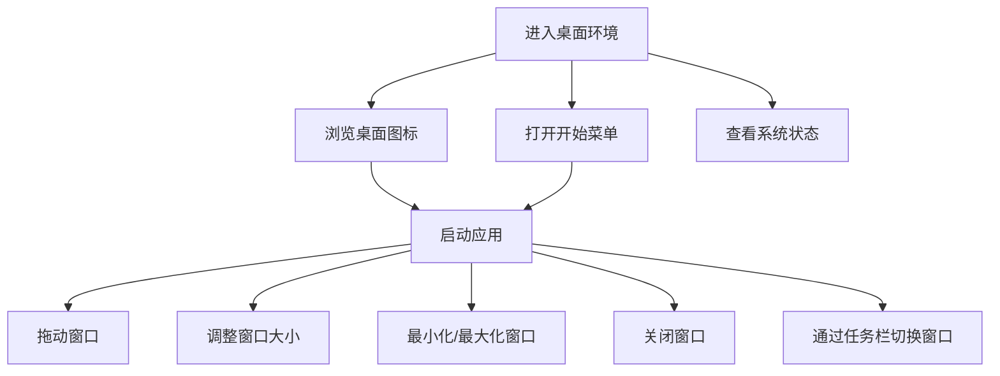

## 1. Product Overview
桌面环境系统是一个模拟操作系统界面的web应用，提供类似桌面的用户体验。
- 主要功能包括窗口管理、应用启动、系统状态监控等，解决用户在web环境中体验桌面操作的需求。
- 目标用户为需要在浏览器中使用模拟桌面环境的用户，具有一定的技术演示和学习价值。

## 2. Core Features

### 2.1 User Roles
| 角色 | 注册方式 | 核心权限 |
|------|----------|----------|
| 普通用户 | 无需注册 | 访问所有桌面功能 |

### 2.2 Feature Module
1. **桌面主页**：桌面背景、应用图标、开始菜单、任务栏
2. **窗口系统**：窗口拖动、大小调整、最小化/最大化、关闭
3. **系统应用**：文件管理器、任务调度器、AI决策中心、系统日志、系统警报
4. **系统状态**：CPU、内存、磁盘、网络监控

### 2.3 Page Details
| 页面名称 | 模块名称 | 功能描述 |
|----------|----------|----------|
| 桌面主页 | 桌面背景 | 显示渐变背景和网格效果，提供视觉层次感 |
| 桌面主页 | 应用图标 | 显示可点击的应用图标，点击启动相应应用 |
| 桌面主页 | 开始菜单 | 点击开始按钮展开应用列表，可快速启动应用 |
| 桌面主页 | 任务栏 | 显示运行中的应用，点击切换窗口，显示系统时间和日期 |
| 窗口系统 | 窗口管理 | 支持窗口拖动、大小调整、最小化/最大化、关闭操作 |
| 系统应用 | 文件管理器 | 模拟文件系统操作，显示文件和文件夹 |
| 系统应用 | 任务调度器 | 管理系统任务，显示任务状态和执行情况 |
| 系统应用 | AI决策中心 | 提供AI辅助决策功能 |
| 系统应用 | 系统日志 | 显示系统运行日志，提供日志查询功能 |
| 系统应用 | 系统警报 | 显示系统警报信息，提供警报管理功能 |
| 系统状态 | 资源监控 | 实时显示CPU、内存、磁盘、网络使用情况 |

## 3. Core Process
用户进入桌面环境后，可以通过以下流程操作：
1. 点击桌面图标或开始菜单启动应用
2. 拖动窗口到任意位置
3. 调整窗口大小以适应需要
4. 最小化/最大化/关闭窗口
5. 通过任务栏切换不同窗口
6. 查看系统状态和时间信息

## 4. User Interface Design
### 4.1 Design Style
- 主色调：深蓝色(#0f172a)、青色(#06b6d4)
- 按钮样式：圆角矩形，带有轻微的3D效果
- 字体：等宽字体(monospace)用于系统元素，无衬线字体用于内容
- 布局风格：卡片式布局，带有玻璃态效果(glassmorphism)
- 图标风格：使用lucide-react图标库，风格统一简洁

### 4.2 Page Design Overview
| 页面名称 | 模块名称 | UI元素 |
|----------|----------|--------|
| 桌面主页 | 桌面背景 | 渐变背景(#0f172a到#1e293b)，带有网格效果，透明度10% |
| 桌面主页 | 应用图标 | 圆形或方形图标，带有青色边框，悬停时显示发光效果 |
| 桌面主页 | 开始菜单 | 玻璃态面板，带有应用列表，点击时展开/收起动画 |
| 桌面主页 | 任务栏 | 底部固定，半透明背景，显示运行中的应用和系统信息 |
| 窗口系统 | 窗口界面 | 玻璃态面板，带有标题栏、控制按钮和内容区域 |
| 系统应用 | 应用界面 | 统一的卡片式布局，带有标题和内容区域 |

### 4.3 Responsiveness
- 桌面优先设计，支持1024px以上的屏幕尺寸
- 适配不同分辨率的显示器，窗口大小可根据屏幕尺寸自动调整
- 触摸优化，支持触摸设备上的窗口拖动和操作

### 4.4 3D Scene Guidance
- 无需3D场景，采用2D界面设计