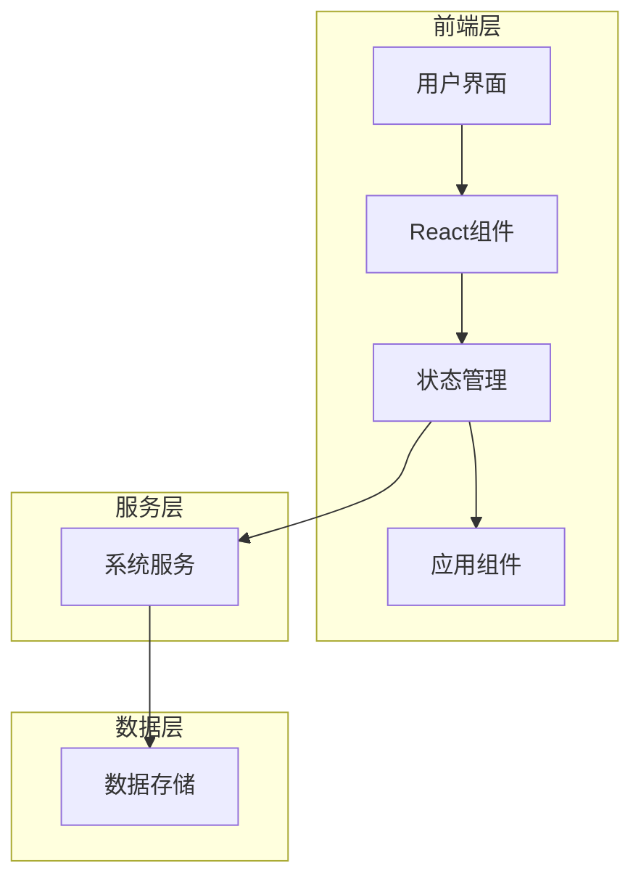
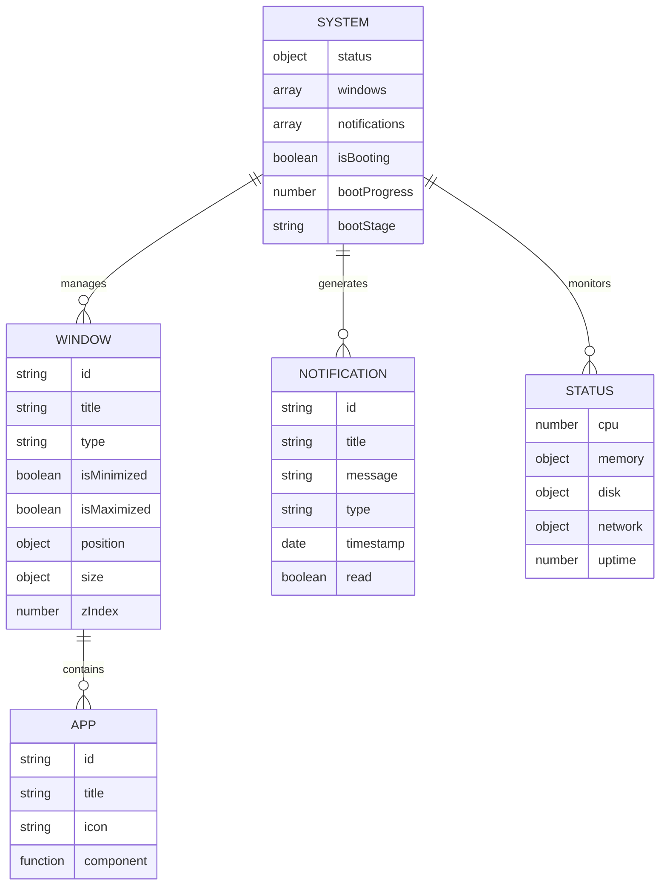

## 1. Architecture Design

## 2. Technology Description
- 前端：React@18 + TypeScript + Tailwind CSS + Framer Motion
- 状态管理：Zustand
- 图标库：Lucide React
- 构建工具：Vite
- 数据存储：LocalStorage (模拟)

## 3. Route Definitions
| 路由 | 用途 |
|------|------|
| / | 系统启动页 |
| /desktop | 桌面环境主页 |

## 4. API Definitions
无后端API，所有数据均在前端模拟。

## 5. Server Architecture Diagram
无后端服务，纯前端实现。

## 6. Data Model
### 6.1 Data Model Definition

### 6.2 Data Definition Language
无数据库，使用内存状态和LocalStorage模拟数据存储。